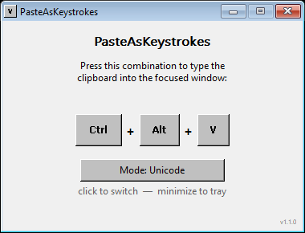

# PasteAsKeystrokes



Tiny Windows utility (~500 lines of C, no dependencies, no installer, single
~34 KB `.exe`) that types the current clipboard contents as real keyboard
input into the focused window.

Useful where `Ctrl+V` is blocked or unavailable: remote consoles (SSH, KVM,
vSphere, RDP/Citrix), BIOS/UEFI, virtual machine consoles, password fields,
and similar places.

## Download

Grab the pre-built executable from the [latest GitHub release](https://github.com/esp3tek/PasteAsKeystrokes/releases/latest):

**[PasteAsKeystrokes.exe](https://github.com/esp3tek/PasteAsKeystrokes/releases/latest/download/PasteAsKeystrokes.exe)** (~34 KB, no installer).

Just double-click to run.

### Verify the binary (optional)

Current build (v1.2.1) SHA-256:

```
832DFE426FF5563EFC7676C830DB75BBFB4ADEF2FADA613BFD5C42FBDEAD6B07
```

On Windows: `Get-FileHash PasteAsKeystrokes.exe -Algorithm SHA256`

### Windows SmartScreen warning

The first time you run the downloaded `.exe`, Windows SmartScreen may
show **"Windows protected your PC"** because this binary is not signed
with a paid code-signing certificate. The file is safe (you can verify
the SHA-256 above and read the entire source in this repo).

To run it: click **More info** → **Run anyway**.

## Usage

1. Run `PasteAsKeystrokes.exe`. A small window appears.
2. Copy text to the clipboard.
3. Switch focus to the target window (terminal, password field, etc).
4. Press **Ctrl + Alt + V**. The text is typed character by character.

Minimize the window to send it to the system tray. Right-click the tray
icon for `Show` / `Exit`. The clipboard is never modified.

## How it works

For each character of the clipboard, the app looks up the corresponding
**virtual key + modifier combination in your current Windows keyboard
layout** (via `VkKeyScanW`) and injects it with `SendInput`. This is the
same default approach used by KeePass auto-type, AutoHotkey `Send`, and
AutoIt — it works transparently for local Windows applications and for
remote tools (AnyDesk, RDP, TeamViewer) when the *remote system uses the
same keyboard layout* as your local Windows.

Characters that don't exist in the current layout (CJK, emoji, accents
outside it) fall back to `KEYEVENTF_UNICODE`. Surrogate pairs are emitted
as a single `SendInput` batch. Newlines (`\r\n`, `\r`, `\n`) are sent as
the Enter key. Tabs go through Unicode injection so they insert a literal
tab character in editors that intercept `VK_TAB` as control navigation.

Before typing, the app waits up to 500 ms for you to physically release
`Ctrl`, `Alt`, `Shift` and `Win`, so holding the hotkey a moment longer
doesn't corrupt the first character.

### Cross-layout note

If you connect to a remote system whose keyboard layout differs from your
local one (e.g. Spanish Windows → US-configured Linux server via a
web-based KVM viewer), characters that depend on shifted symbols may come
out wrong. This is a limitation that affects every keyboard-injection
tool: no client-side trick can change how the remote receiver interprets
keystrokes.

Universal rule:

> KVM viewer layout = local Windows layout = target OS layout

If the three line up, everything works. To temporarily switch your local
Windows layout, use `Win + Space`.

## Build from source

Requires either **MSVC** (`cl.exe`) or **MinGW-w64** (`gcc`) on `PATH`.

```
build.bat
```

Manual MinGW build:

```
windres resources.rc -O coff -o resources.o
gcc paste_as_keystrokes.c resources.o -o PasteAsKeystrokes.exe -mwindows -luser32 -lshell32 -lgdi32 -s -O2
```

## License

MIT — see [LICENSE](LICENSE). Copyright (c) 2026 esp3tek.
